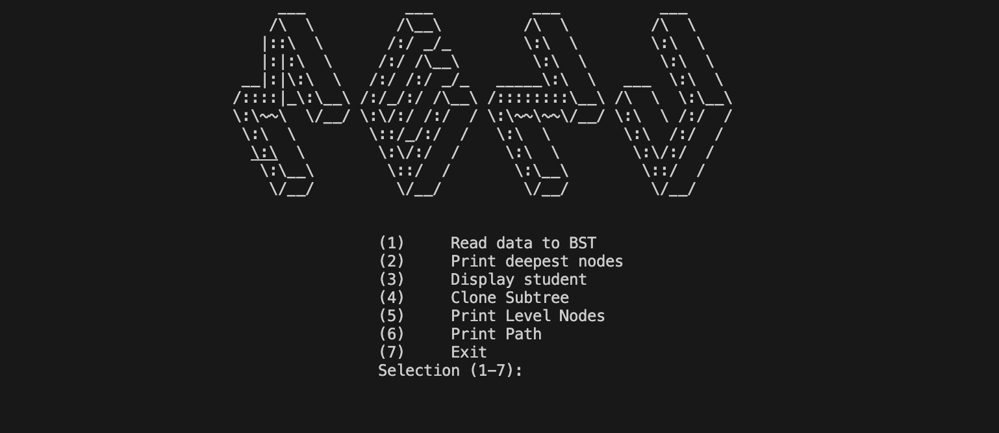

# Student Records Management System (Binary Tree, C++)

Simple student records manager implemented using a binary search tree in C++.

Demo link: https://onlinegdb.com/jT5xGXMLR-



## Features
- Store student records in a binary search tree (BST)
- Add, search, and manage students using text files as sample input

## Project files
- `app.cpp` - application entry / helper logic
- `BST.cpp`, `BST.h` - binary search tree implementation
- `BTNode.cpp`, `BTNode.h` - binary tree node implementation
- `Node.cpp`, `Node.h` - generic node utilities
- `Queue.cpp`, `Queue.h` - queue utilities used by the app
- `Student.cpp`, `Student.h` - student data model
- `student-info.txt`, `student.txt`, `student1.txt`, `student2.txt`, `student3.txt`, `student4.txt` - sample student data files

## Build & Run (Visual Studio 2025 / 2026)

Follow these steps to clone this repository from GitHub and run it in Visual Studio 2025 or 2026.

1. Clone the repo locally:

```powershell
git clone https://github.com/MK-0406/Student_Records_Management_System_using_Binary_Tree_cpp.git
cd Student_Records_Management_System_using_Binary_Tree_cpp
```

2. Open the project in Visual Studio:
- In Visual Studio: **File → Open → Folder...** and select the cloned repository folder.

3. Build and run:
- Build: **Build → Build Solution** (or `Ctrl+Shift+B`).
- Run with debugger: **Debug → Start Debugging** (or `F5`).
- Run without debugger: **Debug → Start Without Debugging** (or `Ctrl+F5`).
